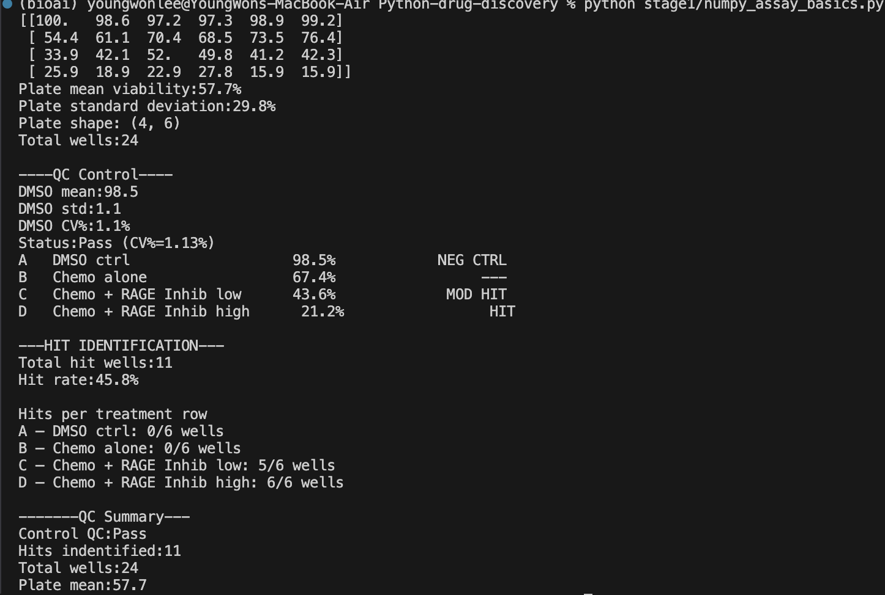

# Stage 1 — NumPy Fundamentals: TNBC Combination Drug Screen

Simulates a cell viability assay plate for triple-negative breast cancer (TNBC) cells treated with a chemotherapy + RAGE inhibitor combination. Models a realistic 4x6 plate reader output and performs standard HTS analysis using NumPy.

## What it does

1. **Plate simulation** — generates a 4x6 well plate with biologically realistic viability distributions per treatment group
2. **Plate QC** — calculates DMSO control CV% and flags pass/fail
3. **Per-treatment analysis** — computes row means and classifies each condition (NEG CTRL / MOD HIT / HIT)
4. **Hit identification** — applies Boolean masking to flag wells below 50% viability

## Treatments modeled

| Row | Treatment | Expected Viability |
|-----|-----------|-------------------|
| A | DMSO control | ~97.5% |
| B | Chemo alone | ~68% |
| C | Chemo + RAGE Inhibitor (low) | ~44% |
| D | Chemo + RAGE Inhibitor (high) | ~22% |

## Output



## How to run

```bash
python numpy_assay_basics.py
```

Requires: `numpy`
