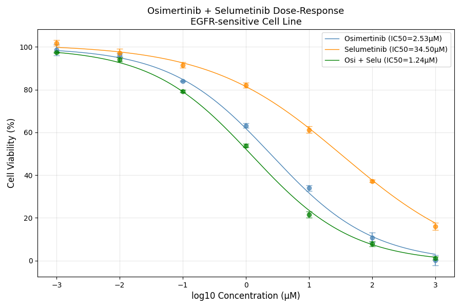
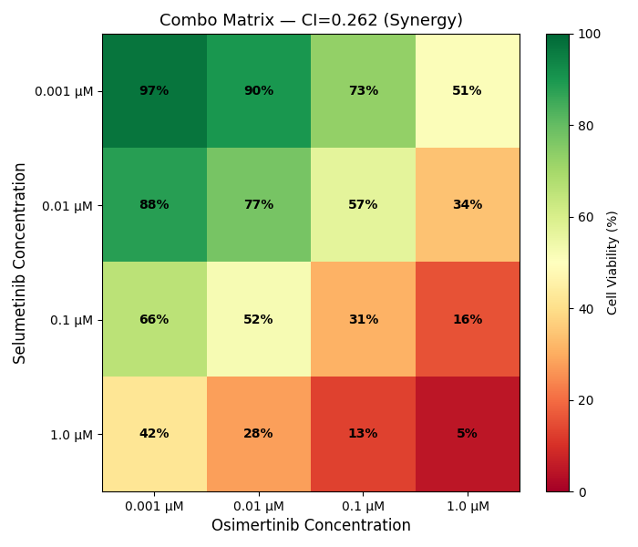

# Stage 2 — Dose-Response Curves & Combination Analysis

Full dose-response pipeline analyzing an Osimertinib + Selumetinib
combination screen on an EGFR-sensitive lung cancer cell line.

## What it does
1. **Data setup** — 3 compounds with 3 simulated replicates per condition
2. **QC masking** — flags wells below 20% viability, reports flagged concentrations
3. **Quick IC50** — estimates IC50 for all 3 compounds using np.interp()
4. **Fitted IC50** — fits Hill equation via curve_fit(), calculates R² per compound
5. **Ranking** — sorts compounds by fitted IC50, prints ranked table
6. **Combination Index** — calculates CI, interprets synergy vs antagonism
7. **Dose-response plot** — all 3 fitted curves + error bars on one graph
8. **Heatmap** — combo dose matrix with RdYlGn colormap

## Compounds screened
| Compound | Target | Expected IC50 |
|---|---|---|
| Osimertinib | EGFR inhibitor (3rd gen) | ~2.53 µM |
| Selumetinib | MEK inhibitor | ~34.50 µM |
| Osi + Selu | EGFR + MEK combo | ~1.24 µM |

## Output
── QC Masking ──
Osimertinib: 2 wells below 20% viability → flagged at:[ 100. 1000.]uM 
Selumetinib: 1 wells below 20% viability → flagged at:[1000.]uM 
Osi + Selu: 2 wells below 20% viability → flagged at:[ 100. 1000.]uM 

──Quick IC50 (np.interp) ──
Osimertinib: IC50=2.50 µM
Selumetinib: IC50=30.99 µM
Osi + Selu: IC50=1.27 µM

──Fitted IC50 (curve_fit) & R²──
  Osimertinib: IC50=2.53 µM | R²=0.9999
  Selumetinib: IC50=34.50 µM | R²=0.9996
  Osi + Selu: IC50=1.24 µM | R²=0.9997

──Ranking──
Rank  Compound            IC50
----------------------------------------
1     Osi + Selu          1.24 µM
2     Osimertinib         2.53 µM
3     Selumetinib         34.50 µM

──Combination Index──
CI=0.26: Synergy

──Dose Response Plot──
Plot saved: dose_response_combo.png

──Heatmap──
Heatmap saved: project_ci_heatmap.png

### Dose-Response Curves

### Combination Heatmap

