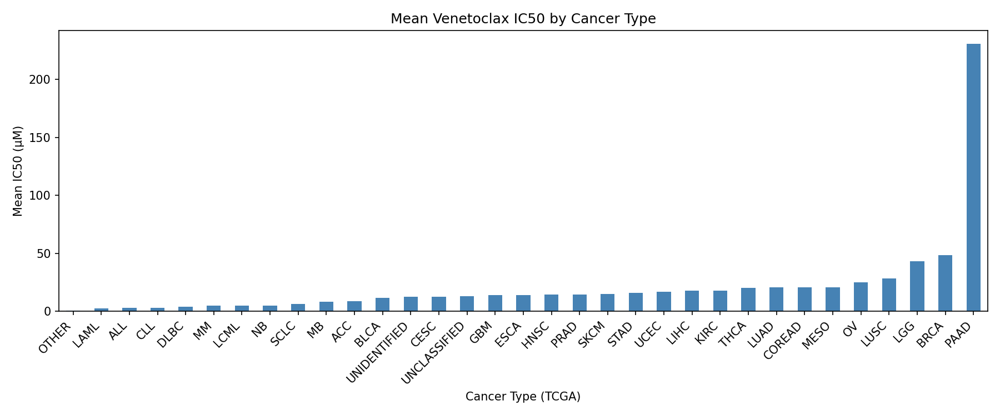
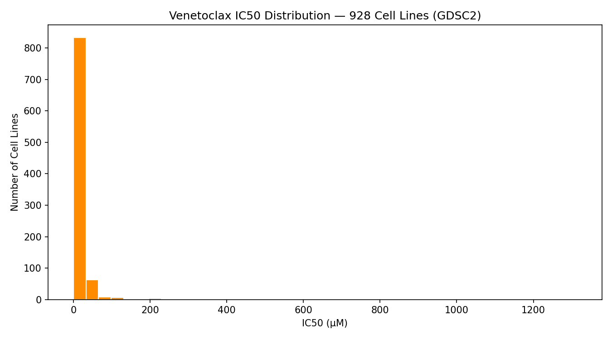

# Stage 3 — Pandas + HTS Data Tables

Cleaning and analyzing a real high-throughput screening dataset (GDSC2)
to identify the most Venetoclax-sensitive cancer cell lines and compare
drug sensitivity across cancer types.

## What it does
1. **Data loading** — loads the full GDSC2 dataset (242,036 rows, 19
   columns), filters to Venetoclax experiments (958 rows)
2. **Data cleaning** — drops rows with missing TCGA cancer type or
   drug target, removes 30 statistical outliers (958 → 928 rows)
3. **Sensitivity classification** — labels each cell line Low/Medium/
   High based on IC50, flags ultra-sensitive lines (IC50 < 0.1 µM)
4. **Cancer type comparison** — groups by TCGA cancer type, ranks by
   mean IC50 (most sensitive cancer types first)
5. **Top sensitivity ranking** — identifies the 10 most
   Venetoclax-sensitive cell lines across the dataset
6. **Visualization** — IC50 distribution histogram + mean IC50 by
   cancer type bar chart
7. **Export** — saves the cleaned dataset to `venetoclax_clean.csv`

## Data Source
**GDSC2** (Genomics of Drug Sensitivity in Cancer), Wellcome Sanger Institute  
Source: https://www.cancerrxgene.org/downloads/bulk_download  
File: "Drug sensitivity data (fitted dose response)" — full release (242,036 rows)  
Filtered to: DRUG_NAME == "Venetoclax" (958 experiments across cancer cell lines)  
*Raw file not included in repo due to size — download from source above.*

## Dataset
| Drug | Source | Target | Experiments |
|---|---|---|---|
| Venetoclax | GDSC2 (Genomics of Drug Sensitivity in Cancer) | BCL-2 inhibitor | 958 (928 after cleaning) |

## Output
```
==================================================
GDSC2 Dataset Overview
==================================================

DataFrame Shape: (242036, 19)

DataFrame Columns:
 ['DATASET', 'NLME_RESULT_ID', 'NLME_CURVE_ID', 'COSMIC_ID', 'CELL_LINE_NAME', 'SANGER_MODEL_ID', 'TCGA_DESC', 'DRUG_ID', 'DRUG_NAME', 'PUTATIVE_TARGET', 'PATHWAY_NAME', 'COMPANY_ID', 'WEBRELEASE', 'MIN_CONC', 'MAX_CONC', 'LN_IC50', 'AUC', 'RMSE', 'Z_SCORE']

Missing Values:
 DATASET                0
NLME_RESULT_ID         0
NLME_CURVE_ID          0
COSMIC_ID              0
CELL_LINE_NAME         0
SANGER_MODEL_ID        0
TCGA_DESC           1067
DRUG_ID                0
DRUG_NAME              0
PUTATIVE_TARGET    27155
PATHWAY_NAME           0
COMPANY_ID             0
WEBRELEASE             0
MIN_CONC               0
MAX_CONC               0
LN_IC50                0
AUC                    0
RMSE                   0
Z_SCORE                0
dtype: int64

Missing values after cleaning:
TCGA_DESC:0
PUTATIVE_TARGET:0
Venetoclax experiments: 958

Sensitivity breakdown:
sensitivity
Low       797
Medium    105
High       56
Name: count, dtype: int64

Outliers flagged: 30
Before:(958, 22) After: (928, 22)

Mean IC50 by cancer type (most sensitive first)
   TCGA_DESC   mean  count
22     OTHER  0.789      1
12      LAML  2.468     20
1        ALL  3.074     20
5        CLL  3.203      2
7       DLBC  3.834     30
20        MM  4.955     15
13      LCML  5.007      8
21        NB  5.016     30
26      SCLC  6.602     57
18        MB  8.529      4

Top10 most sensitive cell lines:
       CELL_LINE_NAME     TCGA_DESC  IC50_uM
178469          GDM-1          LAML   0.0257
179100            VAL          DLBC   0.0271
179051        HCC1500          BRCA   0.0277
178754             RL          DLBC   0.0281
178451         DOHH-2          DLBC   0.0289
178873           NB17            NB   0.0328
178576           ML-2          LAML   0.0371
178537        KP-N-YN            NB   0.0381
178236      NCI-H1963          SCLC   0.0381
179068         KOPN-8  UNCLASSIFIED   0.0423

 Top 10 Most Sensitive Cell Lines (Venetoclax)
 1. GDM-1                LAML            IC50=0.0257 µM  ULTRA
 2. VAL                  DLBC            IC50=0.0271 µM  ULTRA
 3. HCC1500              BRCA            IC50=0.0277 µM  ULTRA
 4. RL                   DLBC            IC50=0.0281 µM  ULTRA
 5. DOHH-2               DLBC            IC50=0.0289 µM  ULTRA
 6. NB17                 NB              IC50=0.0328 µM  ULTRA
 7. ML-2                 LAML            IC50=0.0371 µM  ULTRA
 8. KP-N-YN              NB              IC50=0.0381 µM  ULTRA
 9. NCI-H1963            SCLC            IC50=0.0381 µM  ULTRA
10. KOPN-8               UNCLASSIFIED    IC50=0.0423 µM  ULTRA
```
### Mean IC50 by Cancer Type
 

### IC50 Distribution


 